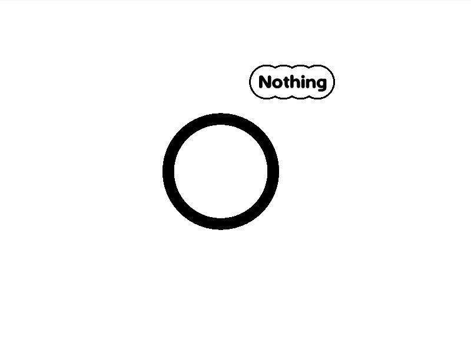
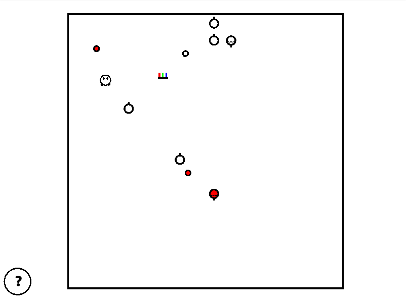

# Egg Farm

This is a game developed for [Ludum Dare 45](https://ldjam.com/events/ludum-dare/45).

Start with reading nothing. Spoilers are disadvised.

## Play

For web version of this game, visit https://kuviman.gitlab.io/egg-farm.

It is also possible to build a native version from source.

## About

Ultra hardcore top down bullet hell farming simulator.



Start as an egg, grow a farm, but beware of angry weed. Do not die, but collect tropheys from your enemies to make your way to the winning screen.




## Build

To build the game from source, you'll need to install [Rust](https://rustup.rs/).

Then, just run

```shell
cargo run --release
```

To build web version, first install [`cargo-web`](https://github.com/koute/cargo-web):

```shell
cargo install cargo-web
```

Then run

```shell
cargo web start --release --open
```